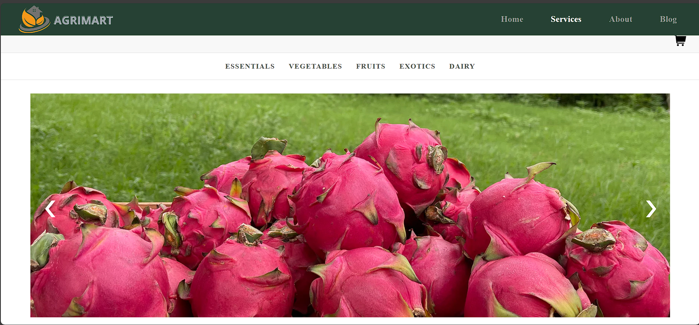

# ***Agrimart***

## Hosting Link: *https://agrimartt.netlify.app/*

### Agrimart is an online marketplace dedicated to offering fresh, organic products, including vegetables, fruits, dairy products . Focused on sustainability and promoting eco-friendly practices, Agrimart connects consumers directly with local organic farmers, ensuring high-quality, chemical-free produce. The platform prioritizes transparency, sustainable farming, and environmentally responsible packaging. Agrimart also gives us loyalty programs to build a community around healthy, organic living. With a grat commitment...


## Why Choose Agrimart?

#### Agrimart is dedicated to providing high-quality, organic produce directly from trusted farmers. We believe in promoting healthy living by ensuring that customers receive fresh, pesticide-free vegetables and fruits, delivered straight to their doorsteps. Agrimart's commitment to sustainability and farm-to-table practices makes it the ideal choice for those who care about their health and the environment.



## Key Highlights:

- **100% Organic Produce:**  Directly sourced from organic farms.

- **Farm-to-Table:** Fresh products with minimal processing or storage time.

- **Wide Range of Products:**  From fruits and vegetables to organic spices,,dairy products.

- **Sustainability Focus:** Supporting eco-friendly practices and local farmers.

- **Reliable Delivery:** Fast and efficient delivery.

## How It Works:

**1. Browse Products:** Visit the Agrimart website to explore a variety of fresh, organic products.

**2. Add to Cart:** Select your favorite items and then this add to the shopping cart. 

**3. Registration or Login Process:** In cart your item is added then further proceed to the login.If your registration is done then do login if your login is successfully done then this page redirect to the checkout page.

**4. Checkout:** Provide delivery details and complete payment securely online.

**5. Delivery:** Your order will be delivered directly to your location within the scheduled time.

## Features:

- **User-Friendly Interface:** Easy-to-navigate website for a seamless shopping experience.

- **Secure Payment Gateway:** Ensures safe and quick transactions.

- **Real-time Order Tracking:** Know exactly when your order will arrive.

- **Freah Organic Products:** All products are oraganic and fresh with gives you trustable shopping.

## Technologies Used:

- **Frontend:** *React.js*

- **Deployment:** *Netlify*

- **Version Control:** *Git and Github*


## Installation Process (For Developers):

**1) Clone the Repository:** 

```bash
   git clone https://github.com/patilmahesh007/icp-8.0-html-css-javascript-React-group-project-4.git
   ```
    

**2) Install Dependencies:** Run npm install to install all required packages.

**3) Run Application:**  npm start

**4) See Output:** Open your browser and go to http://localhost:3000.

Your application is successfully run...✨️

## Contributor
 <a href="https://github.com/patilmahesh007/icp-8.0-html-css-javascript-React-group-project-4/graphs/contributors">

</a>

## Support:

- **Customer Support:** 24/7 customer service for order issues and inquiries.

- **Technical Support:** Comprehensive technical support for setup and troubleshooting.


**If you find our projects its helpfully to buy oragnic products and  great shopping  , consider giving them a ⭐ it means our lot of us!!!**