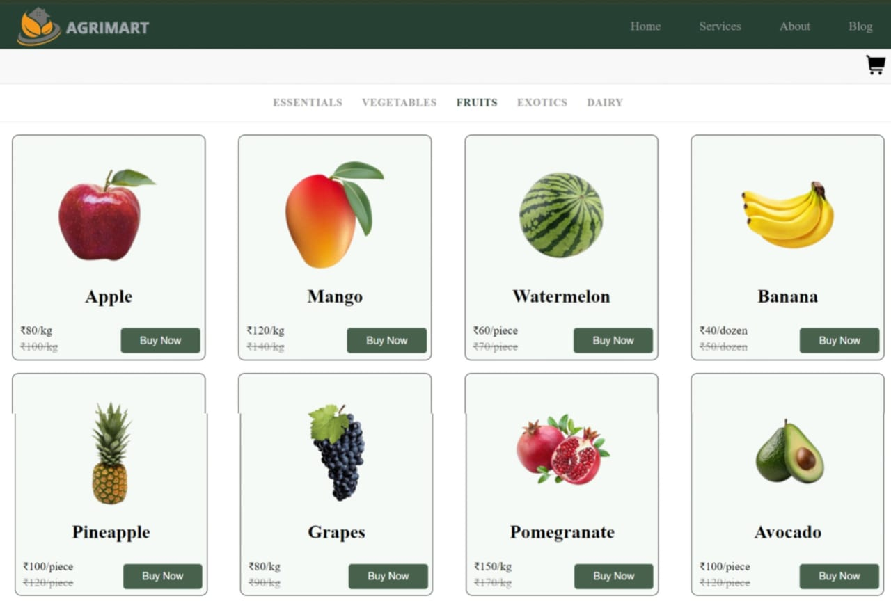

# Agrimart - Fresh & Organic Products Delivered to Your Doorstep 

Welcome to **Agrimart** - where we deliver fresh, organic, and wholesome products directly to your doorstep. At Agrimart, we believe in bringing the goodness of nature straight from farms to your table. With our easy-to-use platform, you can explore a wide range of farm-fresh products and enjoy the convenience of quick delivery.

 ### Website link: https://agrimart-eta.vercel.app/
## Project Structure

### Pages Included:
#### Home Page:

- Basic information about AgriMart is provided here, including the mission, values, and what makes AgriMart unique.

### Service Page:

- Users can explore different products listed here. Each product is displayed in a card format.
Users can:
- Click the "Buy Now" button to add a product to the cart.
- Click on the product card for more detailed information.

#### Product Categories

Agrimart offers a wide variety of products, including:

- **Essentials**: Daily household items such as grains, pulses, and oils.
- **Vegetables**: A fresh variety of seasonal and exotic vegetables.
- **Fruits**: A wide range of farm-fresh fruits, including local and exotic options.
- **Exotics**: Rare and exotic fruits and vegetables from around the world.
- **Dairy**: Fresh milk, yogurt, cheese, and other dairy products.
### About Page:

- Detailed information about the company, its facilities, and commitment to sustainable farming and Non-GMO products.
- **Fresh and Organic**: We guarantee that all our products are 100% organic and sourced directly from trusted farms.
- **Easy-to-Navigate Website**: A user-friendly website that allows easy browsing and ordering.
### Blog Page:

- A collection of articles, news, and information related to sustainable farming, non-GMO products, and agriculture practices.
Features:
### Cart and Purchase System:

- Products can be added to the cart by clicking on the "Buy Now" button.
- Users can view the items in their cart before proceeding to checkout.
### Login/Signup:

- Users are required to create an account or log in to proceed with the checkout and purchase process.
### Checkout Page:

- After logging in, users can access the checkout page where they provide essential details like name, address, and phone number.
### Payment:

- Payment is simulated using Razorpay in Test Mode.
After the transaction, a bill is generated, and the user can download the bill for their records.

### Feedback Submission:

Users can access the Feedback Page from footer to submit their thoughts on their experience, rate products, and provide suggestions for improvement. Feedback data can be stored in Local Storage to persist user input temporarily.

### Local Storage Usage:
- **Cart**: Products added to the cart are stored in Local Storage so that users don’t lose their selection upon page reload.
- **User Login Status**: Login details are stored in Local Storage, allowing users to stay logged in across sessions.
- **Checkout Details**: User details entered during checkout are stored in Local Storage for a seamless experience.
- **Feedback**: Submitted feedback is temporarily stored in Local Storage until it is processed or sent to the backend.

### Usage:
- Access the homepage to learn about AgriMart's offerings.
- Visit the service page to view and purchase products.
- Login or signup to your account.
- Add products to the cart, proceed to checkout, and simulate a payment.
- Download your bill post-transaction.
Contributing:

## Links

- **Website**: [Agrimart Official Website](https://agrimart-eta.vercel.app/)
- **Services**: [Our Services](https://agrimart-eta.vercel.app/services)
- **Blog**: [Read our Blog](https://agrimart-eta.vercel.app/blog)
- **Contact**: [Contact Us](mailto:agrimart@gmail.com)
- **Social Media**:
  - [Instagram](https://www.instagram.com/agrimart20)
  - [Twitter](https://x.com/Agrimart3)

### CONTRIBUTORS : 

### Support :
If you find my projects helpful or interesting, consider giving them a . It means a lot to me!

